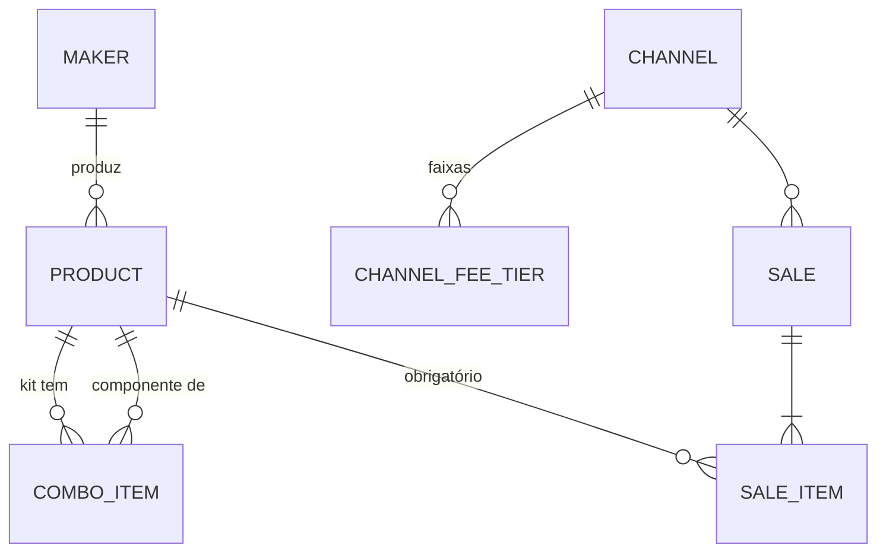

# Gabaarts Control: arquitetura v1

> Status: **fechada em 18/07/2026** com as decisões do Diogo (seção 7). Este documento substitui o brief original: onde houver conflito com o brief do vault (que idealizava e-commerce), **vale o que está aqui**.
> Fonte de domínio: planilha [Gabaarts_Oficial](https://docs.google.com/spreadsheets/d/1xR9bB9rA0yX78Nde4MJitWrIrNutq0tJ_3IsxAovhxk/edit) (lida em 18/07/2026) + decisões de chat.

## Escopo

API interna de gestão da Gabaarts: **vendas, finanças e administrativo**. Não é e-commerce e não há plano ativo de virar um; se um dia virar, catálogo e motor de precificação são reaproveitáveis, mas nada de loja é desenhado aqui.

- Stack: Django + DRF; Django Admin como interface de cadastro na fase 1 (Rouseli, não-técnica, usa o Admin em PT). Na fase 2 o cadastro migra para o React e o Admin vira fallback técnico (decisões C1/C2, seção 7).
- Um negócio só: sem multi-tenant, sem auth complexa, sem microserviço.
- Canais ativos: **Instagram**, **WhatsApp** (ambos diretos, taxa 0), **Shopee** (taxa por faixa), **Site** (gateway %, valor a definir). **Mercado Livre e TikTok ficam fora do seed**; quando entrarem, são só linhas novas na tabela de taxas, sem código novo.

---

## 0. O que a planilha revelou (motivação do design)

### 0.1 Bugs e furos estruturais que a API corrige

1. **Recálculo retroativo do passado.** Mudar custo/hora ou taxa na aba Parâmetros reescreve o lucro de vendas já concluídas. Correção: **snapshot de custo, taxa e frete no momento da venda** (seção 1.3). Decisão mais importante do sistema.
2. **Lucro maior que a receita.** "Impressão papel fotográfico": receita R$ 6,00, lucro R$ 9,00. Fórmula quebrada em item fora do catálogo. Correção: lucro sempre derivado, nunca digitado, e produto obrigatório em toda venda.
3. **Combos inconsistentes.** "Caneca + Chaveiro" mostra lucro sem custo cadastrado, contrariando a própria nota da aba. Correção: kit é produto cadastrado com custo calculado dos componentes.
4. **Data com granularidade de mês** ("jul/2026"). Correção: `DateField` com dia.

### 0.2 Números de validação (custo/hora oficial: Rouseli R$ 12, Filha R$ 10)

Os COGS da planilha foram conferidos manualmente e batem com a fórmula. Eles viram **casos de teste** dos services:

| Produto | Entradas | COGS esperado |
|---|---|---|
| Caneca personalizada | material 10,49 · 10 min Filha · emb. 3,00 | **R$ 15,16** |
| Chaveiro personalizado | material 2,50 · 5 min Rouseli · emb. 3,00 | **R$ 6,50** |
| Caderno 20 matérias | material 55,60 · 100 min Filha · emb. 5,00 | **R$ 77,27** |
| Preço sugerido caneca | COGS 15,16 · margem-alvo 50% | **R$ 30,31** |
| Taxa Shopee a R$ 40,00 | faixa 8 a 80: 20% + 4 | **R$ 12,00** |

---

## 1. Modelo de domínio

Convenção: código e nomes de campo em inglês; `verbose_name` em português (o Admin é a UI da Rouseli). Um projeto Django, **um app** (`core`).

### 1.1 Entidades



| Entidade | Campos essenciais | Classificação |
|---|---|---|
| `Maker` (artesã) | `name`, `hourly_rate` (seed: Rouseli 12,00; Filha 10,00) | plumbing |
| `Product` | `name`, `category` (choices: Presentes, Papelaria, Memórias, Escolar, Outros), `is_active`, `is_combo`; custo: `material_cost`, `packaging_cost`, `waste_pct`, `production_time_min`, `batch_size`, `maker` FK; comercial: `target_margin_pct`, `base_price` | **core** |
| `ComboItem` | `combo` FK, `component` FK, `qty` (kit = 2+ itens; ver 1.4) | **core** |
| `Channel` | `name`, `slug` (`instagram`, `whatsapp`, `shopee`, `site`), `default_freight` (R$/un, nullable; pré-preenche o frete quando o canal tiver valor fixo) | plumbing |
| `ChannelFeeTier` | `channel` FK, `min_price`, `commission_pct`, `fixed_fee` | **core** |
| `Sale` | `date` (dia), `channel` FK, `customer_name` (CharField opcional), `status` (`pending` / `completed` / `canceled`) | **core** |
| `SaleItem` | `sale` FK, `product` FK **obrigatório**, `qty`, `unit_price`; snapshots: `unit_cogs`, `unit_fee`, `unit_freight` | **core** |
| `Equipment` | espelho da aba Equipamentos, zero lógica | plumbing |

Anti-decisões conscientes:

- **`Customer` não é entidade**: CharField basta; a planilha nem preenche cliente. Promover a entidade quando houver necessidade real (histórico por cliente).
- **`Category` é choices**, não tabela: vira tabela só se um dia precisar de gestão dinâmica de categorias.
- **Sem preço por canal** (`ChannelPrice` descartada, decisão B8): o produto tem um `base_price`; o preço efetivamente praticado em cada venda fica registrado na própria venda, e "quanto sobra se eu anunciar a X na Shopee" é o endpoint de simulação, não cadastro. Se um dia vocês mantiverem preços de anúncio permanentemente diferentes por canal, adiciona-se a tabela (3 campos).
- **Sem tabela de resumo**: relatório é `aggregate()` do ORM.

### 1.2 Onde mora cada regra

| Regra | Onde mora | Por quê |
|---|---|---|
| COGS unitário (com breakdown material / MO / embalagem para exibição) | `services/costing.py`, função pura | Testável sem banco; Admin e API exibem o breakdown |
| Mão de obra: `tempo × custo_hora ÷ 60 ÷ lote` | dentro de `costing` | Validada contra a planilha (seção 0.2) |
| Perda: `material × (1 + waste_pct)` (só sobre material; ver 7-A4) | dentro de `costing` | |
| Taxa por canal | `services/fees.py`, **único ponto de entrada** `channel_fee(channel, unit_price)` | Seção 2 |
| Preço sugerido e preço-alvo | `services/pricing.py` | Seção 3 |
| Snapshot na venda | service `create_sale` (chamado pelo Admin via `save_model`/inline e pelo serializer) | Seção 1.3 |
| Relatórios | `services/reports.py`, ORM aggregates | |
| Validações de entrada (preço > 0, qty ≥ 1, produto ativo) | model `clean()` + serializer | Trust boundary; impede o lucro fantasma da planilha |

Princípio: **models guardam dado, services calculam**. Services são funções puras sobre `Decimal`; a camada DRF e o Admin são só transporte.

### 1.3 Decisão core nº 1: snapshot, não recálculo

Ao criar um `SaleItem`, o sistema **congela** `unit_cogs`, `unit_fee` e `unit_freight`. Lucro deriva só dos campos congelados:

```
lucro_unit = unit_price − unit_cogs − unit_fee − unit_freight
```

- Mudar custo/hora ou taxa **não** reescreve o passado.
- Editar uma venda recalcula os snapshots daquela venda, explicitamente.
- Sem versionamento de taxas (`valid_from`): o snapshot já preserva o histórico que importa.

### 1.4 Kits (combos)

Kit é `Product` com `is_combo=True` e 2+ `ComboItem`. Custo do kit:

```
COGS_kit = parcelas próprias do kit (embalagem própria, tempo de montagem se houver)
         + Σ qty × COGS_total do componente
```

Regra única e simples. O caso "Kit 20 bottons" da planilha (custo manual menor que a soma dos componentes) foi confirmado como **exceção que não se repete** (decisão B10); se algum kit futuro tiver custo real diferente da soma, a válvula de escape é cadastrá-lo como produto **simples** com custos próprios, sem código novo. Kit dentro de kit não é suportado (validação impede), até existir caso real.

---

## 2. Cálculo de taxa por canal

### 2.1 Uma forma matemática única

Todas as regras de canal ativas cabem em:

```
taxa(preço) = comissão%(faixa) × preço + fixo(faixa)     faixa escolhida pelo preço
```

Seed inicial de `ChannelFeeTier`:

| Canal | Faixas |
|---|---|
| Instagram | `[0, ∞): 0% + R$0` |
| WhatsApp | `[0, ∞): 0% + R$0` |
| Shopee | `[0, 8): 50% + 0` · `[8, 80): 20% + 4` · `[80, 100): 14% + 16` · `[100, 200): 14% + 20` · `[200, ∞): 14% + 26` |
| Site | `[0, ∞): 5% + 0` (gateway a definir; ajustar a linha quando fechar) |

Mercado Livre e TikTok, quando entrarem, são **inserções de dados** nesta tabela (o modelo de faixas já expressa os dois, incluindo o fixo do ML que só vale entre R$ 12,50 e R$ 79).

### 2.2 Padrão: tabela de dados interpretada, não Strategy de classes

| | Strategy (classes) | Tabela `ChannelFeeTier` + função interpretadora |
|---|---|---|
| Expressividade | Ilimitada | Só regras `% + fixo` por faixa de preço |
| Mudança de taxa | Deploy | Rouseli edita no Admin (a tabela Shopee é "vigente 03/2026"; taxa de marketplace muda) |
| Código | 4+ classes idênticas parametrizadas + registry | 1 função de ~10 linhas |
| Preço-alvo | Cada strategy precisaria expor a inversa | Álgebra sobre as faixas, genérico (2.3) |

**Escolha: tabela de dados.** Strategy com implementações idênticas parametrizadas é abstração especulativa.

**Mitigação de risco:** `fees.channel_fee(channel, unit_price)` é o único ponto de entrada para taxa no sistema. Se um canal futuro tiver regra que não cabe em faixas (ex.: custo fixo do ML por peso/dimensão, se confirmado quando o ML entrar), ele vira um desvio dentro dessa função, sem mudar quem chama.

### 2.3 Circularidade do preço-alvo (Shopee)

Para achar o preço que entrega margem `m`:

```
preço = (COGS + frete + fixo) / (1 − comissão% − m)
```

`fixo` e `comissão%` dependem da faixa, e a faixa depende do próprio preço: ponto fixo.

**Solução: enumeração de faixas (exata, sem iteração numérica).**

1. Para cada faixa, assumir `(pct, fixo)` e resolver o preço em forma fechada.
2. Aceitar só se o preço resultante cai dentro da própria faixa.
3. Adicionar como candidatos os limites inferiores de cada faixa (onde a taxa salta).
4. Responder o menor preço candidato cuja margem real ≥ alvo.
5. `m + pct ≥ 1` na faixa (caso da faixa de 50%): sem solução ali; sem solução em faixa nenhuma, responder "margem inatingível neste canal".

Por que não busca binária: a margem é **descontínua** nas fronteiras (cresce dentro da faixa, despenca ao cruzar para cima). Enumerar é exato, O(nº de faixas), e cada faixa vira caso de teste.

**Subproduto, as "zonas mortas":** em R$ 79,99 a taxa Shopee é R$ 20,00; em R$ 80,00 vira R$ 27,20. Todo preço entre 80,00 e 88,35 rende menos líquido que 79,99. O solver detecta e o endpoint avisa: "fique em 79,99 ou pule para 88,36+". A planilha não dá essa resposta.

---

## 3. A joia: precificação e apuração de margem

### 3.1 Definições travadas

- **Margem sobre o preço** (não markup): `margem% = (preço − COGS − taxa − frete) / preço`. Confirmado pela planilha (caneca: 15,16 / 0,5 = 30,31).
- **Margem de contribuição**: sem rateio de custo fixo por peça. Regra de ouro mantida.
- **Perda só sobre material** (`material × (1 + waste_pct)`): perda real é insumo estragado (impressão errada, sublimação falha); embalagem não se perde junto. Se a prática mostrar o contrário, muda-se a fórmula em um único lugar (`costing`).
- **`Decimal` em tudo**, nunca float. `DecimalField(max_digits=9, decimal_places=2)`; percentuais com 4 casas; `ROUND_HALF_UP` aplicado uma vez, no fim de cada cálculo.

### 3.2 Funções (assinaturas conceituais)

| Função | Entrada | Saída |
|---|---|---|
| `costing.unit_cogs(product)` | produto ou kit | `{material, labor, packaging, total}`; kit conforme 1.4 |
| `fees.channel_fee(channel, unit_price)` | canal, preço | `{pct, fixed, total}` |
| `pricing.suggested_price(cogs, margin)` | custo, margem-alvo | preço cost-plus (canais diretos) |
| `pricing.target_price(channel, cogs, margin, freight=None)` | canal, custo, margem | preço + avisos (faixa usada, zona morta próxima); `freight` default do canal |
| `pricing.simulate(product, channel, price, freight=None)` | | margem R$ e %, situação vs meta |
| `reports.sales_summary(from, to, channel=None)` | período | receita, lucro, ticket médio, nº vendas, quebra por canal; só `completed` |

Frete: manual por item de venda (`unit_freight`), pré-preenchido com `Channel.default_freight` quando existir (decisão A5).

---

## 4. Superfície da API e faseamento

### Fase 1: MVP interno (sem DRF) — concluída em 19/07/2026 (main `74d296d`, 45 testes)

Models + migrations + Admin em PT + services + testes dos services (casos da seção 0.2). O Admin exibe os calculados readonly (COGS com breakdown, preço sugerido, situação vs meta) e a venda usa inline de itens com snapshot automático. **A fase 1 sozinha aposenta a planilha.**

- Sem importador: 19 produtos e 11 vendas, recadastro manual.
- Seed de `Maker`, `Channel` e `ChannelFeeTier` via data migration.

### Fase 2: API completa + front interno (DRF + React) — escopo revisto em 19/07/2026

Revisão de escopo (decisões C1/C2, seção 7): **o cadastro migra do Admin para o React**. A API deixa de ser só leitura/cálculo e ganha CRUD completo das entidades de domínio; o Admin permanece como fallback técnico e como gestão de usuários/tokens (DECISIONS.md #008).

| Endpoint | O quê |
|---|---|
| CRUD `/api/products/` (componentes de kit aninhados) | catálogo com COGS decomposto e preço sugerido |
| CRUD `/api/channels/` (faixas de taxa aninhadas) | canais com faixas |
| CRUD `/api/makers/` · CRUD `/api/equipment/` | artesãs e equipamentos |
| CRUD `/api/sales/` (itens aninhados; `?from=&to=&channel=`) | vendas com snapshot no create/update via `services/sales` |
| `POST /api/pricing/simulate/` | `{product, channel, price, freight?}` → taxa, margem R$ e %, situação vs meta |
| `POST /api/pricing/target-price/` | `{product, channel, margin, freight?}` → preço + avisos (faixa usada, zona morta) |
| `GET /api/reports/summary/?from=&to=&channel=` | resumo de vendas (KPIs do dashboard) |

Auth: DRF TokenAuth + tela de login no React (DECISIONS.md #008); `IsAuthenticated` como default global.

Execução decomposta em 3 sub-projetos (decisão C5), cada um com spec e plano próprios:

1. **2a — API DRF completa** — concluída em 20/07/2026. Serializers com validação (trust boundary reaproveitando o `clean()` dos models), CRUD com escrita aninhada, endpoints de cálculo e TokenAuth. Os 19 produtos da planilha viraram teste parametrizado (`tests/test_catalog.py`), estendendo os casos da seção 0.2.
2. **2b — Fundação do frontend**: Vite + Tailwind + shadcn, identidade e tokens via pipeline do DESIGN.md, login, e a tela de referência (listagem de produtos) validada pela Rouseli.
3. **2c — Telas restantes**: CRUDs (vendas com itens, kits, canais/faixas, artesãs, equipamentos), simulador de preço e dashboard.

Dashboard da fase 2 (decisão C3): cards de receita/lucro/ticket médio/nº de vendas + quebra por canal + filtro de período, usando somente `reports.sales_summary`. Sem services novos.

### Evoluções possíveis (não desenhadas, só anotadas)

- **Finanças/administrativo**: despesas fixas mensais + depreciação de `Equipment` → ponto de equilíbrio (a própria planilha anota isso como "futuro"). Entra como módulo quando a margem de contribuição estiver rodando.
- Mercado Livre e TikTok: inserção de faixas na tabela quando os canais ativarem (confirmar na hora as tabelas vigentes; a nota da planilha sobre ML por categoria/peso será validada aí).

---

## 5. Registro de over-engineering evitado

| Tentação | Por que não |
|---|---|
| Strategy classes por canal | Tabela de dados faz o mesmo e a dona edita sem deploy |
| Versionamento de taxas | Snapshot na venda já preserva o histórico |
| Entidade `Customer` | CharField até existir necessidade real |
| Tabela de preço por canal | Simulação sob demanda; preço real fica na venda |
| Importador de planilha | 19 produtos, 11 vendas: mão é mais rápido |
| Tabela de resumo materializada | `aggregate()` resolve nesse volume |
| App por entidade | Um app `core` |
| Celery, cache, fila | Nada aqui é lento nem assíncrono |
| Desenhar e-commerce/checkout | Fora de escopo por decisão explícita |
| Kit dentro de kit | Sem caso real; validação bloqueia |

---

## 6. Itens em aberto (não bloqueiam a fase 1)

1. **Gateway do Site**: % a definir; seed provisório 5%, ajustar a linha da tabela quando fechar.
2. **Frete fixo por canal**: preencher `default_freight` dos canais quando os valores existirem (hoje tudo 0).

---

## 7. Log de decisões (chat de 18/07/2026)

| # | Pergunta | Decisão |
|---|---|---|
| A1 | Custo/hora | **Planilha**: Rouseli 12,00 / Filha 10,00 |
| A2/A3 | TikTok e Mercado Livre | **Fora do seed**; entram como dados quando ativarem |
| A4 | Perda/refugo | Recomendação aceita: **só sobre material** |
| A5 | Frete | **Manual por venda**, com default fixo por canal quando existir (`Channel.default_freight`) |
| B6 | Estrutura de venda | **Cabeçalho + itens** (`Sale` + `SaleItem`) |
| B7 | Item avulso | **Não existe**: tudo vira produto cadastrado; kit = produto com 2+ componentes |
| B8 | Preço por canal | **Descartado** como cadastro; simulação sob demanda |
| B9 | Instagram vs WhatsApp | **Dois canais separados**, ambos taxa 0, para controle |
| B10 | Custo do Kit 20 bottons | **Exceção que não se repete**; regra de kit é a soma dos componentes (1.4) |
| Escopo | E-commerce | **Não é e-commerce**: API interna de vendas, finanças e administrativo; o brief antigo do vault está desatualizado e este doc prevalece |

### Chat de 19/07/2026 (escopo da fase 2)

| # | Pergunta | Decisão |
|---|---|---|
| C1 | Onde fica o cadastro na fase 2 | **React** (CRUD primeiro); Admin vira fallback técnico. O recadastro dos 19 produtos e 11 vendas será feito pelo React, não pelo Admin |
| C2 | Linha de corte de telas | **Todas as entidades de domínio no React** (produtos, kits, vendas, canais, faixas, artesãs, equipamentos); usuários/tokens seguem no Admin (#008) |
| C3 | Dashboard | Mínimo: KPIs do `sales_summary` existente (receita, lucro, ticket médio, nº vendas, quebra por canal) com filtro de período; sem services novos |
| C4 | Identidade visual | Proposta gerada pelo pipeline do DESIGN.md (consulta → tokens → tela de referência); Rouseli valida vendo a tela pronta |
| C5 | Execução da fase 2 | Decomposta em 2a (API DRF) → 2b (fundação front) → 2c (telas); um spec e um plano por sub-projeto |
| C6 | Deploy | **Pendente**: decidir e registrar no DECISIONS.md antes da 2b entregar uso real à Rouseli; fase 1 e 2a rodam local |

---

*Próximo passo: fase 2b — fundação do frontend e validação da tela de referência pela Rouseli.*
